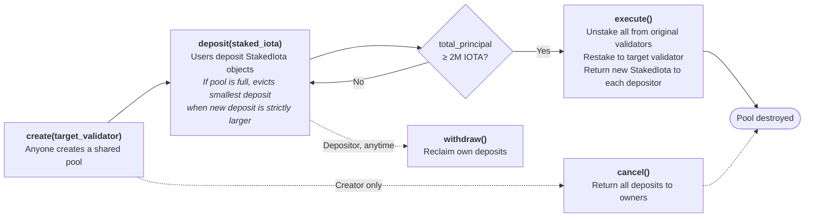

# CandidateStake

An IOTA Move smart contract that lets users pool their staked IOTA to help a candidate validator reach the 2 million IOTA minimum stake required to join the validator set.

## How it works



1. **Create a pool** — Anyone calls `create` with a target validator address. This creates a shared `CandidateStake` object that anyone can interact with.

2. **Deposit** — Users deposit their existing `StakedIota` objects into the pool. Each deposit tracks the original depositor so they can withdraw or receive their restaked tokens back later.

3. **Execute** — Once the pool's total principal reaches 2,000,000 IOTA, anyone can call `execute`. This unstakes every deposit from its current validator and restakes the full balance to the target validator, returning new `StakedIota` objects (including any accrued rewards) to each original depositor. The pool is destroyed after execution. Since deposits stay staked to their original validator until execution, depositors only miss out on a single epoch of staking rewards during the restaking transition — assuming the target validator joins the committee and starts earning rewards the following epoch.

4. **Withdraw** — Before execution, depositors can withdraw their `StakedIota` at any time.

5. **Cancel** — The pool creator can cancel at any time, returning all deposits to their owners and destroying the pool.

## Dust protection

The pool holds up to 1,000 deposits. Deposits are stored in a plain vector — more scalable structures like `LinkedTable` were deliberately avoided to keep the contract simple. If someone tries to deposit when the pool is full, the contract compares the new deposit against the smallest existing one. If the new deposit is strictly larger, the smallest deposit is evicted and sent back to its owner. If not, the transaction aborts. This prevents an attacker from filling the pool with tiny stakes to block legitimate depositors.

## Functions

| Function | Access | Description |
|---|---|---|
| `create` | Anyone | Create a new pool for a target validator |
| `deposit` | Anyone | Deposit a `StakedIota` into the pool |
| `withdraw` | Depositor only | Withdraw all deposits for the caller |
| `execute` | Anyone (when threshold met) | Unstake all, restake to target validator, destroy pool |
| `cancel` | Creator only | Return all deposits, destroy pool |
| `destroy_empty` | Anyone | Clean up a pool after all deposits have been withdrawn |

### View functions

`creator`, `total_principal`, `deposit_count`, `threshold_reached`, `target_validator`, `depositor_of`, `principal_of`

## Build and test

Requires the [IOTA CLI](https://docs.iota.org/developer/getting-started/install-iota).

```sh
iota move build
iota move test
```
